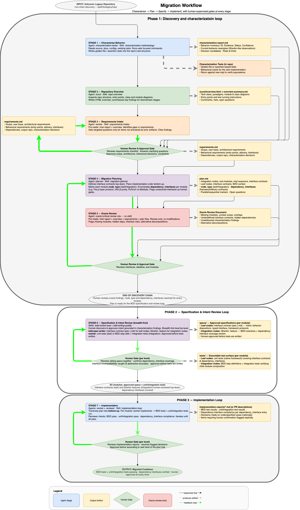

# Agentic Migration Workflow

A human-in-the-loop workflow for migrating legacy scientific codebases (Fortran, C++, legacy Python) to modern target languages and stacks.

This is not a magic wand. It sets up a structured collaboration between a human supervisor and an AI agent, with explicit gates at every major decision point.

---

## How it works

Three phases, each gated by human approval:

1. **Discovery** — characterize the legacy codebase, gather requirements, produce a reviewed migration plan
2. **BDD** — write Gherkin specs and executable tests breadth-first over the plan tree, one level at a time
3. **Implementation** — implement modules bottom-up against approved specs and tests, reviewer loop per module

The core design principle is **spec-driven development**: Gherkin specs and the approved requirments.md are the central source of truth. They define desired behavior before any code is written, double as executable acceptance tests, and gate the implementation phase. Insufficiently specified or misspecified specs are the main failure mode — take time to review them carefully, and understand your intent and needs first.

The migration plan this workflow creates is decomposed as a dependency tree: **interface contracts defined top-down, implementation ordered bottom-up**. This surfaces interface incompatibilities early and ensures each module can be implemented against a stable contract.



Editable diagram: [workflow.drawio](workflow.drawio)

---

## Requirements

- [Pi coding agent](https://pi.dev/)
- [pi-subagents](https://github.com/nicobailon/pi-subagents) plugin
- [pi-intercom](https://github.com/nicobailon/pi-intercom)
- An LLM provider configured in Pi.

---

## Installation

Copy the workflow assets into Pi's agent directory:

```bash
cp -r agents/ prompts/ skills/ ~/.pi/agent/
```

For other agents (Claude Code, etc.), copy into the equivalent config directory (e.g. `~/.claude/`).

---

## Usage

Start a Pi session and apply the phase prompt you want to run:

```
Apply prompts/discovery.md

source_repo: /path/to/legacy/repo
output_repo: /path/to/new/repo
target_language: Python
```

Or run the full three-phase workflow from one entrypoint:

```
Apply prompts/migration-workflow.md

source_repo: /path/to/legacy/repo
output_repo: /path/to/new/repo
target_language: Rust
```

You can also use slash commands: `/discovery ...`.

---

## Example

Migrating a Fortran numerical solver to Julia:

```
Apply prompts/discovery.md

source_repo: ~/projects/legacy-solver
output_repo: ~/projects/solver-jl
target_language: Julia
target_framework: LinearAlgebra + SciML
migration_scope: numerical kernel only
behavior_policy: equivalent within tolerances
```

Discovery produces `discovery/plan.md` and `discovery/oracle-review.md`. After human approval of the plan, run:

```
Apply prompts/bdd-loop.md

source_repo: ~/projects/legacy-solver
output_repo: ~/projects/solver-jl
artifact_dir: ~/projects/solver-jl/discovery
```

BDD produces `.feature` files under `specs/` and executable tests. After human approval at each plan tree level, run:

```
Apply prompts/implementation-loop.md

source_repo: ~/projects/legacy-solver
output_repo: ~/projects/solver-jl
artifact_dir: ~/projects/solver-jl/discovery
```

You can also use the `migration-workflow` prompt to initiate the full migration workflow at once. Note that there are advantages to having a fresh context when switching phases, though, especially when it comes working with specifications. Context leakage might mask underspecified or misaligned scenarios, or bias the implementation in unintended ways.

---

## Workflow elements

### Agents

| Agent | Phase | Role |
|-------|-------|------|
| `characterization-tester` | Discovery | Observes and records legacy behavior; optionally writes golden-file and assertion tests |
| `bdd-spec-writer` | BDD | Writes Gherkin specs from plan module entries; read-only tools (cannot write code) |

Built-in pi-subagents (`scout`, `worker`, `reviewer`, `oracle`, `planner`) are used directly throughout as needed.

### Prompts

| Prompt | Phase | What it does |
|--------|-------|--------------|
| `migration-workflow.md` | All | Full three-phase entrypoint; delegates to the phase prompts |
| `discovery.md` | Discovery | Characterizes the source repo, gathers requirements, produces a reviewed plan |
| `bdd-loop.md` | BDD | Breadth-first spec and test loop over the approved plan |
| `implementation-loop.md` | Implementation | Bottom-up implementation loop over approved specs and tests |

### Skills

| Skill | Phase | What it encodes |
|-------|-------|-----------------|
| `characterization-methodology` | Discovery | How to observe and record legacy behavior without modifying it |
| `repo-overview` | Discovery | How to generate a structural HTML overview of an unfamiliar codebase |
| `requirements-intake` | Discovery | How to elicit and validate migration requirements |
| `migration-planner` | Discovery | How to decompose a migration into a dependency tree with interface contracts |
| `bdd-writing-quality` | BDD | What good BDD specs and tests look like; coverage checklist; traceability rules |
| `bdd-review-loop` | BDD | Breadth-first traversal protocol; per-level human gates |
| `implementation-loop` | Implementation | Bottom-up traversal protocol; worker→tests→reviewer loop; implementation report format |

Reference examples (golden-file tests, BDD feature files, plan module entries) are in `skills/*/references/`.

---

## Human gates

Your role is domain authority, not rubber stamp:

1. **After requirements intake** — approve scope, behavioral policy, constraints
2. **After migration plan + oracle review** — approve the module tree and resolve oracle concerns before any spec work begins
3. **After each BDD level** (breadth-first, top-down) — approve sibling specs as a group; interface incompatibilities between siblings surface here
4. **After each implementation level** (bottom-up) — review implementation reports; resolve flagged dependency interface decisions before ascending
